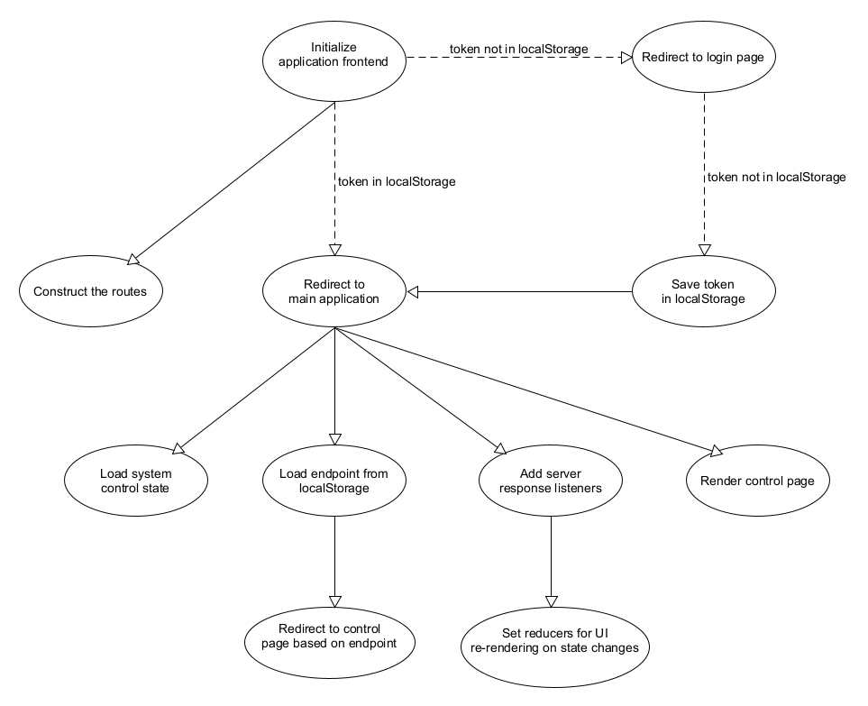
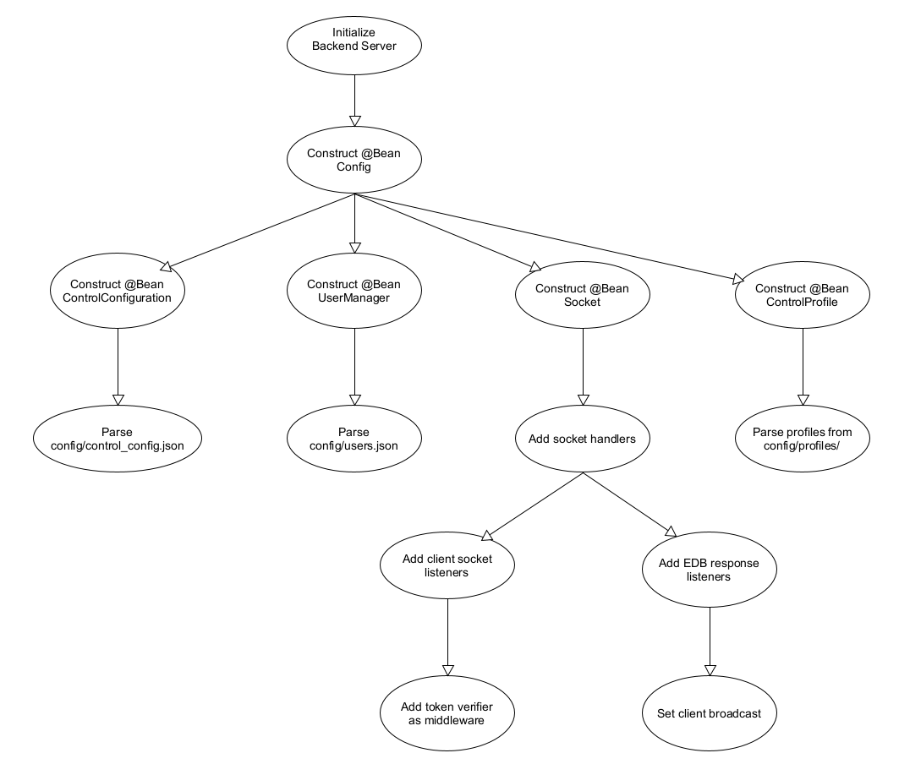
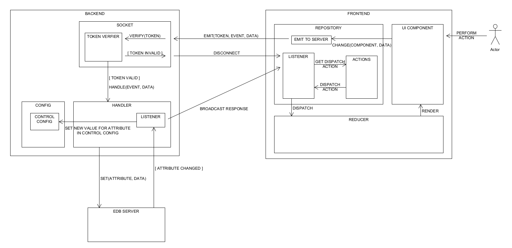

# WEB CONTROL CENTER PROJECT

Bachelor Project Winter Semester 21-22

## Project Structure
- Frontend: `/frontend`
- Backend: `/javabackend`

## Configure Connection
The connection for the application can be configured in:
- /frontend/package.json: backend server url, rest api port, socket port
- /config/application.properties: ebd server url, ebd socket port

## Deploy the project in Docker
- Make sure that `frontend/package.json` is configured for Linux kernel: script `start`, which sets application to use port 5000, should be `PORT=5000 react-scripts start` 
- Run `docker-compose up`

## Implementation
- Application Frontend

- Server Backend

The documentation regarding implementation can be found in [wiki](./wiki)

## Workflow

